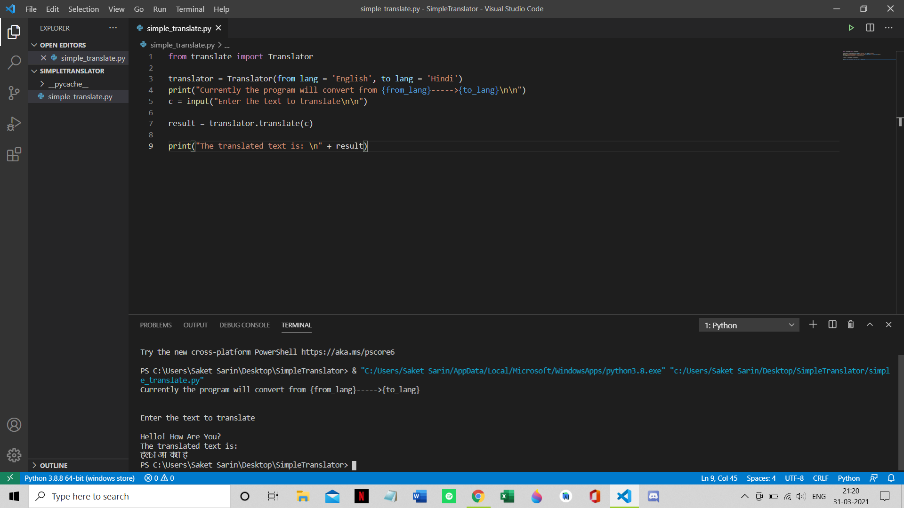

# Procedure... 

### Modules used : translate
   
    For Windows : python -m pip install translate
    
##### replace the value of _from_lang_ and _to_lang_ of your choice languages && In translate() add the text you want to translate

#### OUTPUT ::::   
   Input (inside the code) : Hello! How Are You? ......(English)
###### After Execution:   

   
